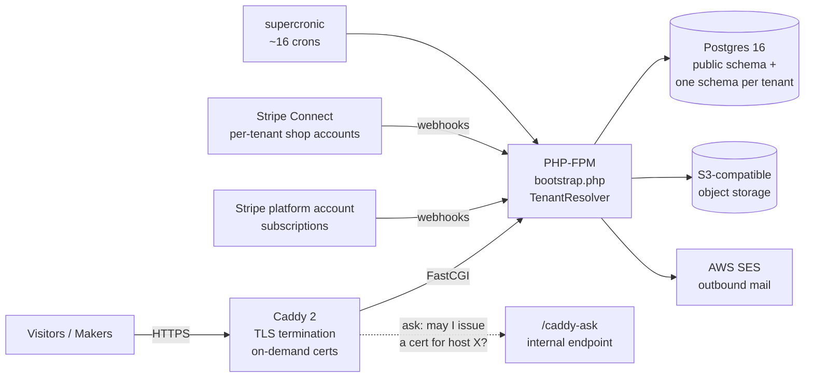

# makerfolio SaaS Architecture

A reference architecture for [makerfolio][mf] — a multi-tenant,
hosted portfolio platform for makers ("WordPress.com, but every
theme, feature, and admin screen is shaped for makers"), built by
turning an existing single-tenant PHP CMS into a SaaS without
rewriting its controllers.

This repository is **not** the product. It is the architecture:
the decisions, the reasons, and the maps into the (private) product
codebase that make the claims checkable. The product is PHP 8
server-rendered with no framework, Postgres schema-per-tenant,
Caddy + PHP-FPM on Docker, one Hetzner VM, Stripe Billing +
Stripe Connect, AWS SES, and S3-compatible object storage — live
in production at [makerfolio.art][mf].

## System at a glance



One request, one tenant: `bootstrap.php` resolves the tenant from
the `Host` header and runs `SET search_path TO "tenant_<id>", public`
once; every inherited single-tenant controller then executes
**unmodified** against that tenant's schema.

## What's here

```
ARCHITECTURE.md      ← the WHY: nine decisions, each with problem /
                        decision / alternatives / seams / verified-by
docs/                # Subsystem reference (the HOW it fits together)
├── 01-system-context.md          ← product, actors, stack, lineage
├── 02-tenancy.md                 ← schema-per-tenant, lifecycle, provisioning
├── 03-routing-and-tls.md         ← Caddy, tenant resolution, custom domains
├── 04-data-model.md              ← public + tenant schema catalogs, cross-schema rules
├── 05-billing-and-payments.md    ← the two Stripe planes, webhook contract
├── 06-security.md                ← auth keyspaces, isolation, support sessions
├── 07-operations.md              ← deploy, crons, email, storage, observability
└── 08-invariants.md              ← the seven invariants + decision log + open questions

code/                # Developer walkthroughs (the WHERE in the source)
├── 01-tenancy-bootstrap-routing.md   … 10-custom-domains-tls.md
└── README.md        ← one walkthrough per subsystem, each grounded in
                        file:line references into the product repo

src/                 # The load-bearing contracts, runnable, in a toy domain
├── Database.php                  ← PDO wrapper; setSchema/resetSchema (search_path)
├── TenantResolver.php            ← Host header → tenant classification (pure)
├── Resolution.php                ← what the resolver decided
├── Tenant.php                    ← lifecycle transitionTo() + atomic provision()
├── TenantDomain.php              ← the 8-state custom-domain machine
├── CaddyAsk.php                  ← the cert-issuance gate as a pure policy
├── MigrationRunner.php           ← idempotent SQL-file runner with per-schema ledger
├── PlatformMigrationRunner.php   ← fleet fan-out with per-tenant isolation
└── WebhookHandler.php            ← the INSERT-first webhook idempotency contract

sql/                 # Portable toy schema (SQLite + Postgres)
├── public/001_platform.sql       ← tenants, tenant_domains, billing_events, audit
└── tenant/001_init.sql, 002_note_tags.sql   ← generic notes domain + example
                                               idempotent incremental migration

tests/               # Verifies the contract claims in ARCHITECTURE.md
├── TenantResolverTest.php        ← §1 the host-classification matrix
├── MigrationRunnerTest.php       ← §3 idempotency, lost-ledger re-apply, fan-out isolation
├── WebhookDedupTest.php          ← §4 dedup, crashed-mid-flight retry, mail-after-commit
├── StateMachineTest.php          ← §6 valid edges, audit rows, invalid jumps throw
├── CaddyAskTest.php              ← §7 the allowlist matrix incl. the 30-day cutoff
└── PgSearchPathTest.php          ← §1 real-Postgres isolation (skips without PG_DSN)
```

Three layers, three questions — plus proof: `ARCHITECTURE.md` answers
*why is it shaped this way*, `docs/` answers *how do the subsystems
fit together*, `code/` answers *where does the product's source do
it*, and `src/` + `tests/` make the load-bearing contracts runnable.
The toy cut uses a generic notes domain, mirroring the sibling
[my-pottery-studio-architecture][mpsarch] repo's approach: the
patterns without the product.

## What this demonstrates

The architectural decisions documented in detail in
[ARCHITECTURE.md][arch], with where each one is developed:

1. **Schema-per-tenant tenancy via `search_path`** — cross-tenant
   leakage made impossible at the SQL layer, not discouraged at the
   review layer; a forgotten schema-set fails loud, never silently.
   *([§1][arch], [docs/02][d2], [code/01][c1];
   [src/Database.php](src/Database.php),
   [src/TenantResolver.php](src/TenantResolver.php),
   [tests/PgSearchPathTest.php](tests/PgSearchPathTest.php))*

2. **Fork the CMS; multi-tenancy lives in the bootstrap** — ~100
   inherited controllers carry into the SaaS unmodified because
   tenancy, edge, dialect, and storage changed underneath them.
   *([§2][arch], [docs/01][d1])*

3. **Idempotent per-tenant migrations with failure isolation** —
   every migration re-applies harmlessly; each tenant keeps its own
   ledger; one broken tenant never blocks the fleet.
   *([§3][arch], [code/09][c9];
   [src/MigrationRunner.php](src/MigrationRunner.php),
   [src/PlatformMigrationRunner.php](src/PlatformMigrationRunner.php),
   [tests/MigrationRunnerTest.php](tests/MigrationRunnerTest.php))*

4. **Webhook-driven Stripe state** — INSERT-first dedup, handler in
   a transaction, mail after commit; local billing state flips only
   on enumerated webhook events, never optimistically.
   *([§4][arch], [docs/05][d5], [code/04][c4];
   [src/WebhookHandler.php](src/WebhookHandler.php),
   [tests/WebhookDedupTest.php](tests/WebhookDedupTest.php))*

5. **Two Stripe planes that never cross** — platform subscriptions
   vs. per-tenant Connect shops; tenants are merchant of record for
   their own sales; the platform fee is a data column, not a rewrite.
   *([§5][arch], [code/05][c5])*

6. **State machines behind `transitionTo()`** — tenants, domains,
   Connect accounts, and sender identities mutate through one
   validated, audited path; invalid transitions are unrepresentable.
   *([§6][arch], [docs/02][d2];
   [src/Tenant.php](src/Tenant.php),
   [src/TenantDomain.php](src/TenantDomain.php),
   [tests/StateMachineTest.php](tests/StateMachineTest.php))*

7. **On-demand TLS gated by `/caddy-ask`** — runtime-added customer
   domains get zero-config certs, but only after a DNS ownership
   challenge; lapsed tenants stop consuming rate-limit headroom.
   *([§7][arch], [docs/03][d3], [code/10][c10];
   [src/CaddyAsk.php](src/CaddyAsk.php),
   [tests/CaddyAskTest.php](tests/CaddyAskTest.php))*

8. **Three auth keyspaces + audited support sessions** — operator,
   tenant admin, and buyer never share a namespace; "log in as
   tenant" is louder than normal access, not quieter.
   *([§8][arch], [docs/06][d6], [code/02][c2])*

9. **Boring operations** — one VM, cron not queue, heartbeat
   dead-man's switch, swappable storage/mail/CDN seams; the split to
   multiple VMs changes zero application code.
   *([§9][arch], [docs/07][d7])*

## Running the code

```bash
composer install
composer test          # the contract claims, verified
```

`composer test` is the canonical entry point for the code cut. The
suite runs against in-memory SQLite (no database server needed) and
verifies the dialect-agnostic contracts: migration idempotency and
fan-out isolation, the INSERT-first webhook contract, the state
machines, the resolver's classification matrix, and the `/caddy-ask`
policy. Each test docstring names the ARCHITECTURE.md section it
verifies.

The `search_path` isolation claim itself is Postgres-specific, so
`tests/PgSearchPathTest.php` skips unless you point it at a scratch
database:

```bash
PG_DSN='pgsql:host=localhost;dbname=toy' PG_USER=you vendor/bin/phpunit
```

With Postgres it provisions two real tenant schemas (atomically —
a failed provision is verified to leave nothing behind) and asserts
the two halves of §1: the same unqualified query scoped per tenant,
and the loud `relation does not exist` failure when the schema-set
is forgotten.

Reading the tests is a faster path into the architecture than
reading the source top-down.

## What's not here

This is a reference architecture. It is deliberately missing:

- **The product source.** Controllers, admin UI, marketing site,
  platform-admin console — the code lives in the product repo. The
  `src/` cut is a from-scratch expression of the *patterns* in a
  generic notes domain, not extracted product code; the
  [code/](code/README.md) walkthroughs cite `file:line` into the
  real source, so every claim is checkable without the source being
  republished.
- **The product's test suites.** Each ARCHITECTURE.md section ends
  with *Verified by*, naming the PHPUnit tests and smoke scripts in
  the product repo (420+ tests, 45+ smokes) that pin that section's
  contract against the real implementation. The tests here pin the
  same contracts against the toy cut.
- **Operational secrets.** Deploy runbooks, incident playbooks, and
  monitoring thresholds are summarized in
  [docs/07-operations.md](docs/07-operations.md) but their
  operational detail stays with the product.
- **The upstream self-host CMS.** The single-tenant fork base is its
  own product (MySQL + Apache, self-hosted) and is intentionally
  untouched by everything described here.

If you're looking for any of those things, you're looking for a
different repo.

## Reading order

New to the system? Read [ARCHITECTURE.md][arch] §1–§2 first — they
are the bet everything else rides on. Then
[docs/04-data-model.md][d4] for the shape of the data, then
whichever subsystem you care about. The
[code/](code/README.md) walkthroughs are the fastest path into the
actual source: each names the invariant it demonstrates and cites
the files that implement it.

## Why this exists

The product is the answer to "how do you turn a finished,
framework-less, single-tenant PHP CMS into a multi-tenant SaaS —
with real billing, customer domains, and one-person operations —
without rewriting the code that already works?" The architecture in
this repo is that answer made inspectable: the tenancy model that
required zero controller changes, the webhook and migration
contracts that keep money and schemas correct, and the operational
posture that keeps it runnable by one person.

The full product is private. This architecture is public so the
patterns are verifiable and reusable.

## License

MIT — see [LICENSE](LICENSE).

The MIT license covers the architectural documentation in this
repository. The "makerfolio" name, branding, and product identity
are not licensed for reuse.

## About

Built by [Cynthia Brown][site]. More work at:

- [cynthia-brown.com][site] — portfolio
- [makerfolio.art][mf] — the product this architecture powers
- [mypotterystudio.com][mps] — the studio-tracking app ([architecture][mpsarch])
- [programmingpotter.com][pp] — ceramic work and writing
- [github.com/TitaniaAnn][gh] — other code

[mf]: https://makerfolio.art
[mps]: https://mypotterystudio.com
[mpsarch]: https://github.com/TitaniaAnn/my-pottery-studio-architecture
[site]: https://cynthia-brown.com
[pp]: https://programmingpotter.com
[gh]: https://github.com/TitaniaAnn
[arch]: ARCHITECTURE.md
[d1]: docs/01-system-context.md
[d2]: docs/02-tenancy.md
[d3]: docs/03-routing-and-tls.md
[d4]: docs/04-data-model.md
[d5]: docs/05-billing-and-payments.md
[d6]: docs/06-security.md
[d7]: docs/07-operations.md
[c1]: code/01-tenancy-bootstrap-routing.md
[c2]: code/02-auth-and-security.md
[c4]: code/04-billing-platform-plane.md
[c5]: code/05-shop-connect-plane.md
[c9]: code/09-migrations.md
[c10]: code/10-custom-domains-tls.md
