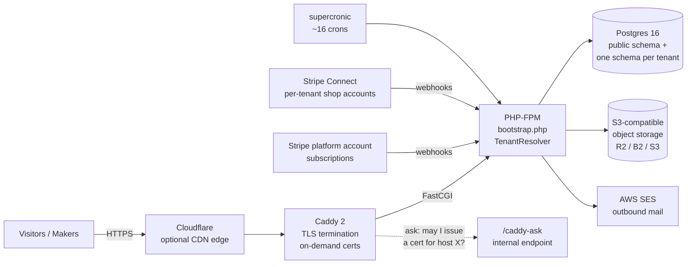

# makerfolio SaaS — Architecture

Architecture documentation for **makerfolio** ([`TitaniaAnn/makerfolio-saas`](https://github.com/TitaniaAnn/makerfolio-saas)) —
a multi-tenant, hosted portfolio platform for makers ("WordPress.com, but every theme, feature, and
admin screen is shaped for makers"). Production apex is `makerfolio.art`.

This repo describes the **as-built** system: PHP 8 server-rendered, no framework, Postgres
schema-per-tenant, Caddy + PHP-FPM on Docker, single Hetzner VM, Stripe Billing (platform
subscriptions) + Stripe Connect (per-tenant shops), AWS SES mail, S3-compatible object storage.

## System at a glance

One request, one tenant: Caddy terminates TLS and proxies to PHP-FPM; `bootstrap.php` resolves the
tenant from the `Host` header and runs `SET search_path TO "tenant_<id>", public` once; every
inherited single-tenant controller then executes **unmodified** against that tenant's schema.

## Documents

| Doc | Covers |
|---|---|
| [docs/01-system-context.md](docs/01-system-context.md) | Product, actors, tech stack, lineage (forked from pottery-profile-cms), sibling repos |
| [docs/02-tenancy.md](docs/02-tenancy.md) | Schema-per-tenant model, tenant provisioning, lifecycle state machine, per-tenant migrations |
| [docs/03-routing-and-tls.md](docs/03-routing-and-tls.md) | Caddy edge, tenant resolution pipeline, custom domains, on-demand TLS, Cloudflare |
| [docs/04-data-model.md](docs/04-data-model.md) | Public-schema catalog, tenant-schema catalog, cross-schema reference rules |
| [docs/05-billing-and-payments.md](docs/05-billing-and-payments.md) | Two Stripe planes, webhook idempotency contract, plan/cap enforcement, dunning |
| [docs/06-security.md](docs/06-security.md) | Three auth keyspaces, isolation layers, CSRF/CSP hardening, support sessions, abuse controls |
| [docs/07-operations.md](docs/07-operations.md) | Deploy topology, cron fleet + heartbeat, email, storage, backups, observability, testing |
| [docs/08-invariants.md](docs/08-invariants.md) | The seven load-bearing invariants + key architectural decisions and their rationale |

Read them in order for the full picture, or jump straight to a subsystem. Every doc cites the
implementing files in the `makerfolio-saas` repo (e.g. `includes/TenantResolver.php`).

## Code walkthroughs

[code/](code/README.md) holds the ten **developer code walkthroughs** — how each subsystem is
actually built, grounded in `file:line` references to the source (mirrored from the main repo's
`design-docs/walkthroughs/code/`, links rewritten to absolute GitHub URLs):

| # | Walkthrough | # | Walkthrough |
|---|---|---|---|
| 01 | [Tenancy, bootstrap & routing](code/01-tenancy-bootstrap-routing.md) | 06 | [Email & deliverability](code/06-email-deliverability.md) |
| 02 | [Auth & security](code/02-auth-and-security.md) | 07 | [Themes & content rendering](code/07-themes-content-rendering.md) |
| 03 | [Signup & provisioning](code/03-signup-and-provisioning.md) | 08 | [Uploads, storage & images](code/08-uploads-storage-images.md) |
| 04 | [Billing — platform plane](code/04-billing-platform-plane.md) | 09 | [Migrations & schema](code/09-migrations.md) |
| 05 | [Shop — Connect plane](code/05-shop-connect-plane.md) | 10 | [Custom domains & TLS](code/10-custom-domains-tls.md) |

The `docs/` set answers *why the system is shaped this way*; the `code/` set answers *where and
how the code does it*.

## The seven invariants (summary)

Breaking any of these causes data leaks or billing bugs — full rationale in
[docs/08-invariants.md](docs/08-invariants.md):

1. **Tenancy is schema-per-tenant via `search_path`** — never a `tenant_id` WHERE clause.
2. **No foreign key crosses the schema boundary**, in either direction.
3. **Stripe state is webhook-driven** — never optimistic local writes; INSERT-first dedup.
4. **State changes go through `transitionTo()`** state-machine methods, not direct UPDATEs.
5. **Migrations are per-tenant and individually idempotent**, with per-tenant failure isolation.
6. **Three distinct auth keyspaces in one session** — platform admin, tenant admin, shop customer.
7. **Custom-domain certs only issue for DNS-verified domains** (`/caddy-ask` gate).

## Status

Feature-complete for the customer-facing launch: Phases 0–6 (Postgres port → multi-tenant plumbing
→ signup → billing → custom domains → object storage → Studio tier), Phases 7a–7o launch
hardening, Phase 9 (per-tenant shop Stripe Connect), plus post-launch operational hardening
(health checks, cron heartbeats, operator digest, webhook ledgers) through ~PR #146. The
per-phase as-built record is `design-docs/COMPLETION_MATRIX.md` in the main repo.
