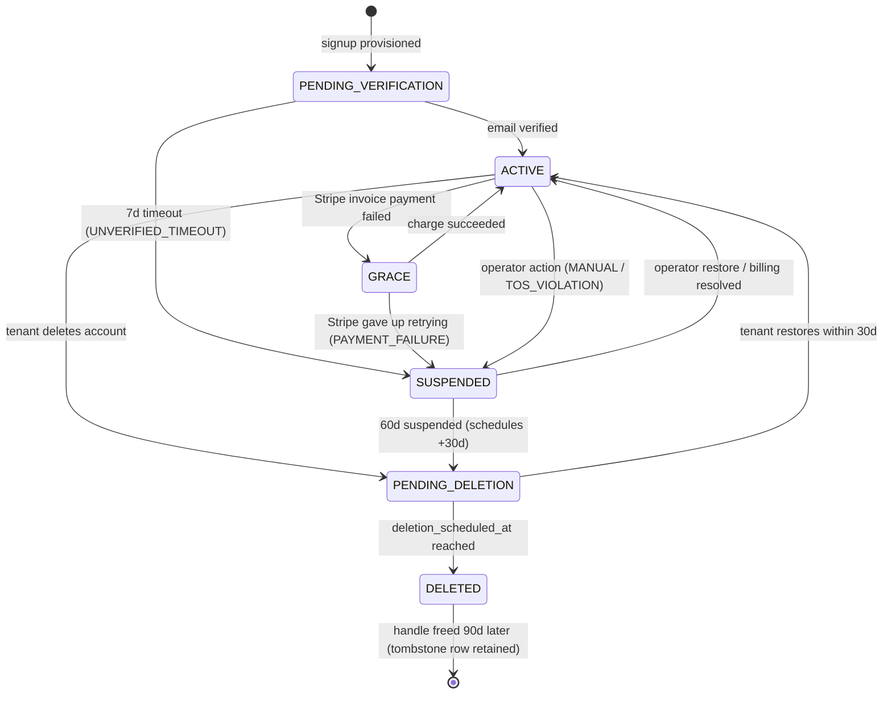

# 02 — Tenancy

## Decision: Postgres schema-per-tenant

Each tenant owns a Postgres schema (`tenant_<id>`) containing a full copy of the inherited CMS
tables. The platform owns the `public` schema. Bootstrap resolves the tenant from the `Host`
header and runs `SET search_path TO "tenant_<id>", public` **once per request**
(`Database::setSchema()`); every subsequent query is automatically scoped.

### Why not row-level (`tenant_id` column)?

| Concern | Row-level `tenant_id` | Schema-per-tenant |
|---|---|---|
| Change to inherited CMS code | Every query in ~100 controllers touched | One bootstrap-level `SET search_path`; queries unchanged |
| Forgetting to scope a query | Silent cross-tenant **data leak** | Impossible at the SQL layer; a missing `setSchema` fails **loud** ("table does not exist") |
| Per-tenant backup / export / delete | `WHERE tenant_id = ?` over every table | `pg_dump --schema=…` / `DROP SCHEMA … CASCADE` |
| Migrations | One run | Loop per schema (proven by django-tenants in the sibling project) |
| Ceiling | ~unlimited | ~10K–50K schemas before Postgres catalog perf degrades — 3–4 orders of magnitude beyond target scale |

The leak-prevention argument is load-bearing: the inherited CMS has ~100 self-contained PHP
controllers touching the DB with no compiler help. Schema-per-tenant makes the failure mode
"error page", never "another tenant's data".

The alternative of bolting an ORM onto the framework-less codebase to enforce row scoping would
have been a far larger rewrite than the MySQL→Postgres port plus a bootstrap middleware.

### Connection pooling note

Schema switching via `SET search_path` is compatible with PgBouncer transaction pooling (the SET
travels with the transaction). Per-tenant Postgres **roles** exist as defense-in-depth for
emergency DBA work and the support-session flow, but the app pool runs as a single `app_user` —
poolers don't reset roles on reuse without `DISCARD ALL`, which would defeat prepared-statement
caching.

## Tenant lifecycle

State machine on `public.tenants.status`, enforced by `Tenant::transitionTo($status, $reason)`
(never direct UPDATE — the method validates the transition, writes the audit row, fires
side-effects like suspension email or Stripe cancel):

- **GRACE**: public site still serves; admin shows a "card declined" banner. Driven by the
  `stripe-dunning-sync` cron + `invoice.payment_failed` webhooks.
- **SUSPENDED**: public site renders a friendly branded "temporarily unavailable" page; admin
  redirects to billing-resolve.
- **DELETED**: `DROP SCHEMA … CASCADE`, object-storage prefix purge, Stripe subscription
  cancelled. The `tenants` row is kept as a **tombstone** so the handle can't be re-claimed for
  90 days (subdomain-takeover defense). Recovery stays possible for ~30 days via PITR backups +
  object versioning.

## Provisioning

`Signup` flow (marketing site `/signup/`) inserts a cheap `public.signups` row first — a Postgres
schema is only allocated **after** email verification, since most signups never verify. On
verification, `Tenant::provision()` runs atomically in one transaction (Postgres DDL is
transactional, so a failure rolls back the `CREATE SCHEMA` too):

1. Insert `public.tenants` row (status `PENDING_VERIFICATION`, plan `free`, `schema_name = tenant_<id>`)
2. `CREATE SCHEMA tenant_<id>`
3. Apply the canonical tenant schema (`sql/init.postgres.sql`) + any incremental migrations
4. Seed default settings, page text, event-type labels, page sections
5. Insert the first `admin_users` row (role OWNER)

Signup is protected by hCaptcha + `signup_attempts` rate limiting, and reserved handles
(hard-coded list — `admin`, `www`, `api`, … + all 2-letter strings — plus the runtime
`handle_reservations` table for trademark/one-off blocks) are rejected. New tenants start in
"coming soon" mode (`site_published` toggle) and go live from Settings.

### Handle renames

`Tenant::rename` (Free: once/year; Pro/Studio: unlimited) writes a `handle_redirects` row; the
resolver 301-redirects the old subdomain for 1 year, then a sweep cron drops the redirect and the
old handle enters the standard 90-day cooldown.

## Per-tenant migrations

Two migration universes, each SQL-first and **individually idempotent** (guarded with
`CREATE TABLE IF NOT EXISTS`, `DO $$ … $$` existence checks, `INSERT … ON CONFLICT` — a file
re-applies harmlessly if its ledger row is lost):

| Universe | Files | Ledger |
|---|---|---|
| Platform | `sql/public/NNN_*.sql` | `public.schema_migrations` |
| Tenant | `sql/migrations.postgres/NNN_*.sql` | `<tenant_schema>.schema_migrations` (each tenant tracks its own apply state) |

`PlatformMigrationRunner` applies public migrations, then loops active tenants applying the
inherited `MigrationRunner` inside each schema with **per-tenant try/finally isolation** — one bad
tenant must not block the rest. Results surface per-tenant in the platform-admin UI with retry
buttons; Docker auto-applies on boot. Because each tenant has its own ledger, a new migration can
roll out tenant-by-tenant.

The same isolation pattern (`for_each_tenant`) is reused by every cron that iterates tenants.
