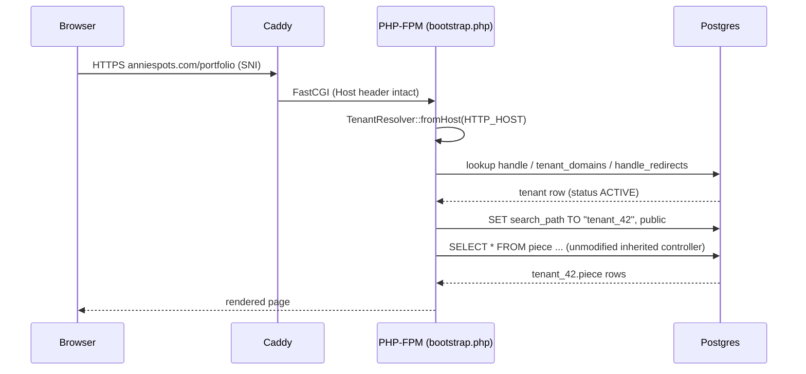
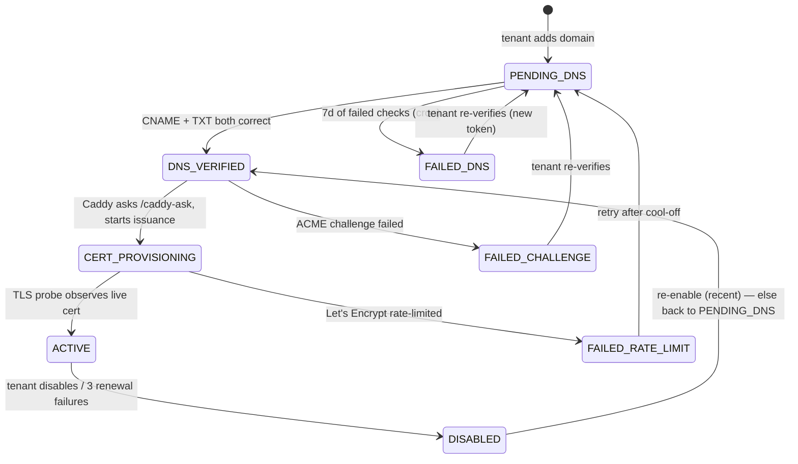

# 03 — Request routing and custom-domain TLS

## Caddy as the front edge

Caddy 2 terminates TLS for three hostname classes and proxies everything to one PHP-FPM pool:

| Hostname class | Cert strategy |
|---|---|
| `makerfolio.art`, `www.makerfolio.art` | Standard ACME cert |
| `*.makerfolio.art` (tenant subdomains) | Single wildcard cert via DNS-01 challenge |
| Any other hostname (custom domains) | **On-demand TLS**: cert issued at first SNI hit, gated by the `/caddy-ask` endpoint |

Caddy was chosen over nginx+certbot specifically for `on_demand_tls`: N customer domains are added
at runtime with **zero per-domain config and no reloads**. Renewals are Caddy-internal (30 days
before expiry, retried with backoff); the platform only *monitors* cert health, it never manages
certs. Cloudflare can sit in front as a transparent CDN (admin assets are `no-store`/revalidated
so deploys aren't masked; the app trusts `CF-Connecting-IP` only from Cloudflare CIDRs — see
[06-security](06-security.md)).

There is no router in the app: Caddy maps clean URLs to files under `public/` (the inherited
mod_rewrite pattern, ported to a Caddyfile), and every entry point requires
`includes/bootstrap.php`.

## Tenant resolution pipeline

`TenantResolver::fromHost($host)` (in `includes/TenantResolver.php`), called from bootstrap after
`Auth::start()`:

1. **Strip port**, lowercase.
2. **Host == `PLATFORM_DOMAIN`** → marketing-site mode, no tenant, public schema only.
   `/platform-admin/*` and `/platform-webhook/*` paths also skip host resolution.
3. **Host ends with `.<PLATFORM_DOMAIN>`** → extract subdomain, look up tenant by `handle`.
   Reserved handles never match tenants. On miss, check `handle_redirects` → 301 to the current
   handle (rename support).
4. **Anything else** → exact-hostname lookup in `public.tenant_domains`; must be `ACTIVE`.
5. **Status gate** — tenant must be `ACTIVE` or `GRACE`. `SUSPENDED` renders the branded
   suspension page; `PENDING_VERIFICATION` serves a "finish setup" page publicly but allows
   `/admin/`. Unpublished ("coming soon") sites render a placeholder until the owner goes live.
6. `Database::setSchema($tenant->schema_name)` — from here on, application code is
   single-tenant-shaped.

The added cost vs. the single-tenant CMS is one cached DB lookup per request.

## Custom domains

The most operationally complex flow in the product. Tenant-side wizard at `/admin/domains/`;
model `includes/TenantDomain.php`; verification in `includes/DomainVerifier.php`.

### Setup flow

1. Tenant adds `anniespots.com` (validated against the Public Suffix List; blocklisted lookalike/
   popular domains rejected; hostname is **globally unique** across tenants — a domain pending for
   another account is rejected at add time). Adding an apex auto-adds the `www.` sibling row.
2. Tenant configures two DNS records at their registrar:
   - `CNAME anniespots.com → tenants.makerfolio.art` (routing)
   - `TXT _makerfolio-verify.anniespots.com → <random token>` (ownership challenge)
3. The `verify-pending-domains` cron (every 5 min) — or the manual "Verify" button — resolves both
   via a public resolver; both correct → `DNS_VERIFIED`.
4. First HTTPS hit (or the monitoring cron's TLS probe) triggers Caddy on-demand issuance; the
   `monitor-provisioning-domains` cron drives the state forward using an SNI handshake probe
   (`includes/TlsCertProbe.php` — Caddy runs `admin off`, so cert presence is *observed*, not
   queried) → `ACTIVE`. Typical wall-clock: 30–90 seconds.

Apex domains can't take CNAMEs: the shipped answer is "use a registrar with ALIAS/ANAME support,
or use `www.` + registrar redirect". Fixed-IP A records are deliberately not offered (they would
freeze the routing tier's IPs).

### State machine (`TenantDomain::transitionTo()`)

All actors — the cron, `/caddy-ask`, the operator's manual retry button — funnel through the same
`transitionTo()` so invalid jumps are impossible and every transition is audited.

## The `/caddy-ask` gate (invariant 7)

Caddy's `on_demand_tls { ask … }` calls an internal-only endpoint before issuing any cert.
It returns **200 only** for hostnames in `tenant_domains` with status
`DNS_VERIFIED` / `CERT_PROVISIONING` / `ACTIVE`, **and** whose owning tenant is
`ACTIVE`/`GRACE` or within the first 30 days of `SUSPENDED` (after that — and for
`PENDING_DELETION`/`DELETED` — it 404s so Caddy stops renewing).

This is the defense against an attacker pointing 10K domains at the platform IP to burn the
Let's Encrypt rate limit: the only path into `DNS_VERIFIED` is completing a TXT ownership
challenge, which requires controlling the domain's DNS. Cert lifetime is also tied to paying/live
tenants, so lapsed accounts don't consume rate-limit headroom indefinitely.

## Cert health monitoring

The daily `cert-health-check` cron TLS-probes every ACTIVE custom domain, refreshes
`cert_expires_at`, and surfaces certs older than 80 days / expiring within 14 days / failing the
handshake in the platform-admin operator queue.
