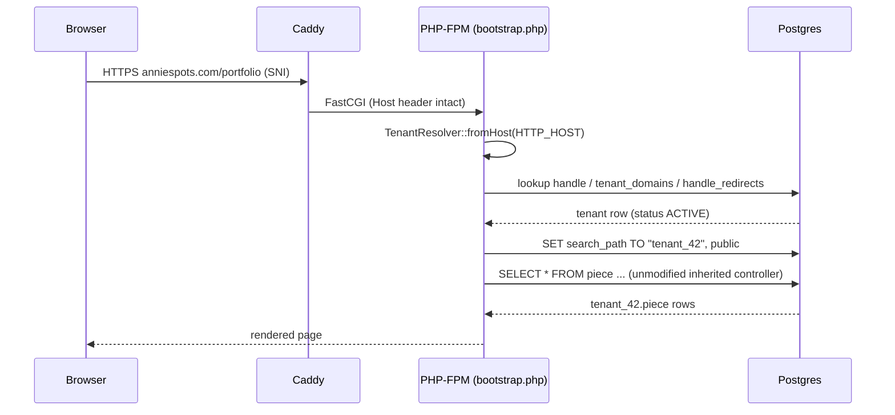
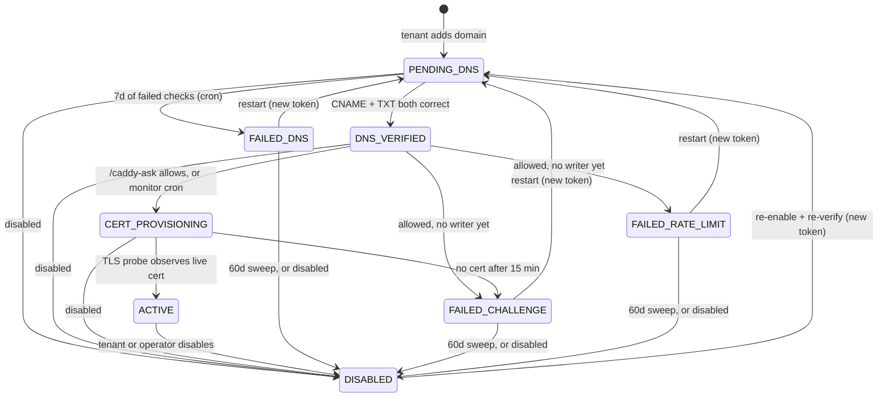

# 03 — Request routing and custom-domain TLS

## Caddy as the front edge

Caddy 2 terminates TLS for two public hostname classes and proxies everything to one PHP-FPM pool:

| Hostname class | Path to the box | Cert strategy |
|---|---|---|
| `makerfolio.art`, `*.makerfolio.art` (apex + tenant subdomains) | Proxied through Cloudflare (Full strict) | A **Cloudflare origin certificate** served from disk; no ACME, no DNS-01, no Cloudflare API token in Caddy |
| Any other hostname (custom domains) | Straight to the box, bypassing Cloudflare | **On-demand TLS** via an `https://` catch-all: Let's Encrypt cert issued at first SNI hit, gated by `/caddy-ask` |

The original design had a DNS-01 wildcard cert for the subdomains; putting Cloudflare in front of
the platform hosts made the origin certificate simpler and removed a credential from the edge.
One DNS detail falls out of the split: `tenants.makerfolio.art`, the CNAME target customers point
their domains at, must be a **DNS-only** record. If the proxied wildcard swallows it, customer
traffic arrives through Cloudflare and on-demand issuance breaks for everyone.

Caddy was chosen over nginx+certbot specifically for `on_demand_tls`: N customer domains are added
at runtime with **zero per-domain config and no reloads**. Renewals are Caddy-internal (30 days
before expiry, retried with backoff); the platform only *monitors* cert health, it never manages
certs. Both public vhosts send HSTS (`includeSubDomains` on the platform vhost only, since the
platform can't make promises about a customer's other subdomains). Admin assets are
`no-store`/revalidated so the CDN can't mask deploys.

A few as-built Caddy lessons are worth knowing before touching the config: `on_demand_tls` takes
only `ask` (the old `interval`/`burst` options crash `caddy run` while `caddy validate` still
accepts them, so a restart is the only real test); the ask URL needs its trailing slash
(`/caddy-ask/`), because newer Caddy 308s the bare directory and the internal ask client refuses
redirects; and the ask is served by an internal `http://localhost:8080` site inside the Caddy
container that is not published by compose.

There is no router in the app: Caddy maps clean URLs to files under `public/` (the inherited
mod_rewrite pattern, ported to a Caddyfile), and every entry point requires
`includes/bootstrap.php`.

## Tenant resolution pipeline

```mermaid
sequenceDiagram
    participant B as Browser
    participant C as Caddy
    participant P as PHP-FPM (bootstrap.php)
    participant DB as Postgres

    B->>C: HTTPS anniespots.com/portfolio (SNI)
    C->>P: FastCGI (Host header intact)
    P->>P: TenantResolver::fromHost(HTTP_HOST)
    P->>DB: lookup handle / tenant_domains / handle_redirects
    DB-->>P: tenant row (status ACTIVE)
    P->>DB: SET search_path TO "tenant_42", public
    P->>DB: SELECT * FROM piece ... (unmodified inherited controller)
    DB-->>P: tenant_42.piece rows
    P-->>B: rendered page
```

`TenantResolver::fromHost($host)` (in `includes/TenantResolver.php`), called from bootstrap after
`Auth::start()`:

1. **Strip port**, lowercase.
2. **Host is `PLATFORM_DOMAIN` or `www.<PLATFORM_DOMAIN>`** → marketing-site mode, no tenant,
   public schema only. `/platform-admin`, `/signup`, `/platform-webhook` are **apex-only**: on a
   tenant or custom host they 404 rather than fall through. `/caddy-ask` is stricter still: it
   only answers `Host: localhost` (the internal ask site) and both public vhosts 404 it at the
   edge, so it can't be used to enumerate domains or nudge the domain state machine.
3. **Host ends with `.<PLATFORM_DOMAIN>`** → extract subdomain, look up tenant by `handle`.
   Reserved handles route to the marketing site. On miss, check unexpired `handle_redirects` → 301
   to the current handle (rename support).
4. **Anything else** → exact-hostname lookup in `public.tenant_domains`; must be `ACTIVE`. The
   auto-added `www.` sibling 301s to its apex once the apex is ACTIVE.
5. **Status gate** — `ACTIVE`, `GRACE` and `PENDING_VERIFICATION` proceed. `SUSPENDED` returns a
   branded 503 on every path, `/admin/` included. Unpublished ("coming soon") sites return a 503
   with `Retry-After` and `X-Robots-Tag: noindex` to anonymous visitors; `/admin/` and signed-in
   viewers bypass it, and `/sitemap.xml` + `/robots.txt` are answered before the gate.
6. `Database::setSchema($tenant->schema_name)` — from here on, application code is
   single-tenant-shaped.

The added cost vs. the single-tenant CMS is one cached DB lookup per request (a per-worker cache
with a 60 s TTL, 128 entries, FIFO eviction).

## One canonical URL per tenant

A tenant with a custom domain is reachable on two hosts (the subdomain and the domain), and before
the 2026-08 SEO work every absolute URL the app generated came from `SITE_URL`, which on a SaaS
box is the apex. The fix is one resolver, used everywhere:

- **`CanonicalHost`** picks the tenant's preferred host: the ACTIVE custom domain flagged
  `is_canonical`, else `<handle>.<platform>`. Memoized per request, fails soft.
- The flag is kept by `TenantDomain::transitionTo()`: the first non-www domain to reach ACTIVE
  becomes canonical, and the flag clears when that domain leaves ACTIVE. Owners can choose a
  different one at `/admin/domains/canonical.php`; a per-tenant partial unique index allows at
  most one.
- `PageMeta::baseUrl()` builds canonical and `og:url` tags from it on every host, with query
  strings stripped. `redirect()` rewrites `SITE_URL`-prefixed targets onto the current tenant
  host, and Stripe return URLs use the current host too.
- The subdomain and custom domain deliberately **don't** 301 to each other; canonical tags carry
  the preference, so a tenant whose domain lapses keeps a working subdomain with no redirect loop.
- A shared `tenant_head()` partial emits meta, canonical, robots, the theme font request and
  JSON-LD (`StructuredData`: WebSite, Organization, Product/Offer, Event, VisualArtwork,
  BreadcrumbList, …) for the public tenant pages.
- Each tenant gets its own `sitemap.xml` on its canonical host (the shop entry only when the plan
  has `shop_links`), `robots.txt` advertises it, and an unpublished site's sitemap 404s. The apex
  sitemap lists published ACTIVE/GRACE tenants.

This is the one place the SEO work reached into inherited controllers: eleven public pages moved
onto `tenant_head()`. Tenancy itself still never touches them.

## Custom domains

The most operationally complex flow in the product. Tenant-side wizard at `/admin/domains/`;
model `includes/TenantDomain.php`; verification in `includes/DomainVerifier.php`.

### Setup flow

1. Tenant (OWNER role, plan with `allow_custom_domain`) adds `anniespots.com`. The platform domain
   and its subdomains are refused; the hostname is **globally unique** across tenants, so a domain
   pending for another account is rejected at add time. The Public Suffix List decides whether the
   host is an apex, and adding an apex auto-adds the `www.` sibling row.
2. Tenant configures two DNS records at their registrar:
   - `CNAME anniespots.com → tenants.makerfolio.art` (routing)
   - `TXT _makerfolio-verify.anniespots.com → <random token>` (ownership challenge)
3. The `verify-pending-domains` cron (every 5 min) — or the manual "Verify" button — resolves both
   over DNS-over-HTTPS (Cloudflare, Google as fallback), which sidesteps the container resolver's
   stale cache; both correct → `DNS_VERIFIED`.
4. First HTTPS hit (or the monitoring cron's TLS probe) triggers Caddy on-demand issuance; the
   `monitor-provisioning-domains` cron drives the state forward using an SNI handshake probe
   (`includes/TlsCertProbe.php` — Caddy runs `admin off`, so cert presence is *observed*, not
   queried) → `ACTIVE`. Typical wall-clock: 30–90 seconds.

Apex domains can't take CNAMEs: the shipped answer is "use a registrar with ALIAS/ANAME support,
or use `www.` + registrar redirect". Fixed-IP A records are deliberately not offered (they would
freeze the routing tier's IPs).

### State machine (`TenantDomain::transitionTo()`)

```mermaid
stateDiagram-v2
    [*] --> PENDING_DNS : tenant adds domain
    PENDING_DNS --> DNS_VERIFIED : CNAME + TXT both correct
    PENDING_DNS --> FAILED_DNS : 7d of failed checks (cron)
    PENDING_DNS --> DISABLED : disabled
    DNS_VERIFIED --> CERT_PROVISIONING : /caddy-ask allows, or monitor cron
    DNS_VERIFIED --> FAILED_CHALLENGE : allowed, no writer yet
    DNS_VERIFIED --> FAILED_RATE_LIMIT : allowed, no writer yet
    DNS_VERIFIED --> DISABLED : disabled
    CERT_PROVISIONING --> ACTIVE : TLS probe observes live cert
    CERT_PROVISIONING --> FAILED_CHALLENGE : no cert after 15 min
    CERT_PROVISIONING --> DISABLED : disabled
    ACTIVE --> DISABLED : tenant or operator disables
    FAILED_DNS --> PENDING_DNS : restart (new token)
    FAILED_DNS --> DISABLED : 60d sweep, or disabled
    FAILED_CHALLENGE --> PENDING_DNS : restart (new token)
    FAILED_CHALLENGE --> DISABLED : 60d sweep, or disabled
    FAILED_RATE_LIMIT --> PENDING_DNS : restart (new token)
    FAILED_RATE_LIMIT --> DISABLED : 60d sweep, or disabled
    DISABLED --> PENDING_DNS : re-enable + re-verify (new token)
```

The diagram is the edge map in [`src/TenantDomain.php`](../src/TenantDomain.php), edge for edge;
[`tests/DomainDiagramTest.php`](../tests/DomainDiagramTest.php) parses this block and fails if
the two drift. "Disabled" means the tenant's disable button or the operator's force-disable;
`sweep-failed-domains` also disables rows left in a `FAILED_*` state for 60 days. Re-entry from
`DISABLED` or any `FAILED_*` state always goes through `PENDING_DNS`, with a rotated verification
token and a fresh DNS check; there is no shortcut back to `DNS_VERIFIED` or `ACTIVE`.

Two notes against the product. Its map matches this one except that it still allows
`DISABLED → DNS_VERIFIED`; the tenant UI never offers that edge (its only re-enable button is the
`PENDING_DNS` restart), so this repo treats it as unintended. And the two `DNS_VERIFIED → FAILED_*`
edges are allowed but nothing writes them yet; challenge failures are detected by the 15-minute
timeout in `CERT_PROVISIONING`.

All actors — the crons, `/caddy-ask`, the tenant's buttons, the operator's force-disable — funnel
through the same `transitionTo()` so invalid jumps are impossible and every transition is
audited.

## The `/caddy-ask` gate (invariant 7)

Caddy's `on_demand_tls { ask … }` calls an internal-only endpoint before issuing any cert.
It returns **200 only** for hostnames in `tenant_domains` with status
`DNS_VERIFIED` / `CERT_PROVISIONING` / `ACTIVE` (plus the platform's own hosts), unless the owning
tenant is `PENDING_DELETION`/`DELETED` or has been `SUSPENDED` for 30 days or more; then it 404s
so Caddy stops renewing. A 200 for a `DNS_VERIFIED` row also moves it to `CERT_PROVISIONING`,
which is why the endpoint had to become unreachable from outside (2026-08 audit, M4).

This is the defense against hostile hostnames burning the platform's Let's Encrypt budget.
Without the gate, every SNI hostname would start an ACME order on the platform's one ACME
account. Every order counts against Let's Encrypt's **New Orders per Account** limit whether it
validates or not, so junk orders crowd out real customers' issuance and renewals. Names that don't
resolve to the platform also fail validation and run up the per-identifier authorization-failure
limits. (**New Certificates per Registered Domain** is keyed on each customer's own registered
domain, so it isn't a shared platform budget.)

What the gate actually requires is a `tenant_domains` row in a verified state. Rows are only
created through `/admin/domains/`, which needs the OWNER role on a plan with
`allow_custom_domain`, so each hostname costs an attacker a paid account rather than a DNS
change. The TXT challenge then proves the account that added the row controls the domain, so one
tenant can't claim another's hostname. Two caveats on how far this goes: the plan is checked
when the row is created and never again (a downgraded tenant's verified domains keep getting
certs and keep routing), and cert lifetime is tied to the tenant's lifecycle status, so lapsed
accounts stop consuming headroom 30 days into suspension.

## Cert health monitoring

The daily `cert-health-check` cron TLS-probes every ACTIVE custom domain, refreshes
`cert_expires_at`, and surfaces certs older than 80 days / expiring within 14 days / failing the
handshake in the platform-admin operator queue. It reports; it never transitions a domain.
