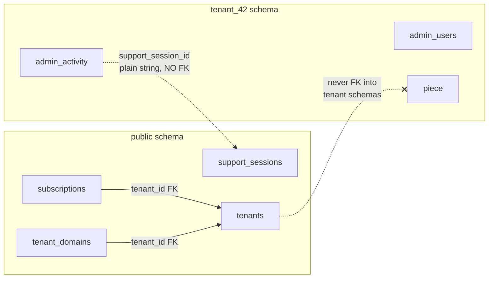

# 04 — Data model

Authoritative column-level detail lives in the main repo's `design-docs/MODELS.md` (spec) and
`sql/` (as-built DDL). This doc maps the two schema universes and the rules that keep them apart.

## Public schema (platform-owned)

One row per logical entity, owned by the operator. Grouped by subsystem, with the migration that
introduced each (`sql/public/NNN_*.sql`, currently 001–029):

### Tenant directory & lifecycle
| Table | Purpose |
|---|---|
| `tenants` | The directory: handle, `schema_name`, status machine, `plan_id`, denormalized `site_title`/`contact_email` (synced by `Tenant::syncContactEmail()` + nightly reconcile cron), Stripe customer id, Stripe **Connect** columns (`stripe_connect_account_id` unique, status, `charges_enabled`), suspension/deletion timestamps, `handle_released_at` (90-day cooldown tombstone), `marketing_opt_out`, `site_published` |
| `plans` | Free/Pro/Studio × monthly/annual rows (interval-specific because Stripe Price IDs are); `max_*` caps (pieces, photos/piece, upload bytes, products, templates, storage, admin users, domains, mail/day), `allow_*` feature flags (custom domain, footer removal, shop, team users, custom sender…), `shop_application_fee_bps`. Plans are deprecated (`is_active=false`), never deleted |
| `signups` | Pre-verification holding pen — a schema is only provisioned after email verification. Abandoned at 14 d, hard-deleted at 90 d |
| `signup_attempts`, `auth_attempts` | Rate-limit ledgers (signup; forgot-password / transfer-accept) |
| `handle_reservations` | Runtime-reserved handles (trademarks, one-offs) on top of the hard-coded list |
| `handle_redirects` | 301 mapping old handle → tenant for 1 year after a rename |
| `transfer_invitations` | Site-ownership transfer flow (Phase 6A) |
| `tenant_reports` | Public "report this site" abuse reports |

### Billing (platform Stripe plane)
| Table | Purpose |
|---|---|
| `subscriptions` | One row per Stripe subscription; `stripe_status` (verbatim) + `local_status` (mapped); partial unique index: at most one current subscription per tenant |
| `billing_events` | **INSERT-first idempotency ledger** for platform webhook events (`stripe_event_id` unique), plus raw payload for debugging |
| `billing_events_revocations` | Refund/revocation audit (Phase 6F) |
| `connect_webhook_events` | Ledger for the Connect-plane webhook endpoint (ops visibility, PR #141) |

### Domains & mail
| Table | Purpose |
|---|---|
| `tenant_domains` | Custom domains: globally-unique hostname, 8-state machine, verification token, cert timestamps, canonical flag, apex/www pairing |
| `tenant_sender_identities` | Studio white-label SES sender identities (PENDING_DNS/VERIFIED/FAILED/DISABLED) |
| `email_bounces` | SNS bounce/complaint receipts, deduped on `sns_message_id` |
| `email_log` | Outbound mail ledger (ops, PR #143) |

### Platform operations
| Table | Purpose |
|---|---|
| `platform_admin_users` | Operator team; 2FA mandatory; `is_superadmin` gates destructive actions |
| `platform_admin_activity` | Append-only audit of every operator action (including what each sweep cron changed) |
| `support_sessions` | Audited "log in as tenant" records: admin, tenant, required reason, 1-hour expiry |
| `usage_rollups` | Nightly per-tenant snapshots (piece/product counts, storage bytes, logins) so dashboards never scan tenant schemas live |
| `cron_runs` | Cron heartbeat dead-man's-switch ledger (every job runs via `bin/cron/run.php` wrapper) |

## Tenant schema (one per tenant)

Every inherited CMS table, unchanged in shape, namespaced inside `tenant_<id>`
(canonical DDL: `sql/init.postgres.sql`; incremental: `sql/migrations.postgres/001–028`):

`admin_users` (+ `role` column for Studio tiers), `settings` (KV: site name, theme, page-text and
email-template overrides, `auth_*` toggles), `piece`, `piece_images`, `products`,
`product_images`, `events`, `event_piece`, `announcements`, `social_links`, `piece_templates`,
`piece_template_files`, `orders`, `social_posts`, `email_templates`, `page_sections`,
`admin_activity`, `password_resets`, `login_attempts`, `stripe_webhook_events`
(the **shop's** Connect-plane dedup log — distinct from `public.billing_events`), and the
per-tenant `schema_migrations` ledger.

Notable as-built evolutions: media tables store only `*_storage_key` columns (the legacy `*_path`
columns were dual-written during the object-storage migration, then dropped); the `pottery` table
family was renamed to `piece` (tables, FKs, routes) when the product widened from potters to
makers; `admin_activity` gained `via_support` + `support_session_id` for the support-session audit
trail; `piece.created_by` supports the CONTRIBUTOR edit-own role gate.

## Cross-schema rules (invariant 2)

- Public tables reference tenants **only** by `tenant_id` (= `public.tenants.id`). They never
  reference rows *inside* a tenant schema — where a tenant value is needed in public (e.g.
  `site_title` for the fleet list), it is **denormalized and reconciled**, accepting eventual
  consistency.
- Tenant tables never FK to public. Plan limits are looked up in code
  (`Plan::find($tenant->plan_id)`), not enforced by constraint. The single cross-schema
  *reference* (`admin_activity.support_session_id`) is a plain string by design.
- Consequence: every tenant schema is independently `pg_dump`-able, drop-able, and restore-able
  with zero cross-dependencies. The cost — no DB-enforced referential integrity across the
  boundary — is accepted deliberately.
- Hardening: the few app queries that intentionally cross into `public.*` are
  **schema-qualified** so a stray `search_path` can never aim a platform query at a tenant schema.

## State-change rules

All shared mutable state moves through validated state-machine methods (invariant 4):

- `tenants.status` → `Tenant::transitionTo()` (audit row + side-effects)
- `tenant_domains.status` → `TenantDomain::transitionTo()` (cron, `/caddy-ask`, and the operator
  retry button all call the same method)
- `subscriptions.local_status` and `tenants.plan_id` → **webhook-driven only** (see
  [05-billing](05-billing-and-payments.md))
- `tenants.stripe_connect_status` → `ShopConnect::transitionTo()` reconciled from
  `account.updated` events
