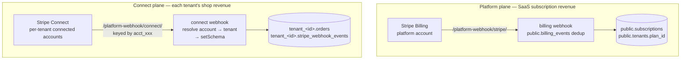

# 05 — Billing and payments

## Two Stripe planes that never cross

1. **Platform plane** (`includes/PlatformStripe.php`, `includes/Subscription.php`): one Stripe
   account owned by the operator charges tenants for Pro/Studio subscriptions. State lives in
   `public.subscriptions` + `public.billing_events`.
2. **Connect plane** (`includes/ShopConnect.php`, `includes/ShopOrders.php`): each tenant
   onboards their **own** connected account (Standard or Express) so their shop's charges land on
   *their* Stripe — direct charges with `stripe_account` + `application_fee_amount` (fee currently
   0 bps, a one-value plan edit away). A tenant losing their Connect setup doesn't touch their
   subscription, and vice versa. The account id lives on `public.tenants` and never FKs across
   the schema boundary.

The inherited self-host webhook (`/shop/webhook.php`, single env-global key, host-resolved) still
exists for the self-host product; the SaaS shop uses the Connect plane.

## Webhook idempotency contract (invariant 3)

Both planes copy the contract proven in the inherited shop webhook:

1. **INSERT the event id into the dedup ledger first** (`public.billing_events` /
   `tenant.stripe_webhook_events`; the unique key serializes concurrent retries).
   A fully-processed retry short-circuits 200.
2. Run the handler inside `Database::transaction()`.
3. Stamp `processed_at`. A crash mid-flight leaves the row with `processed_at IS NULL`, so the
   retry re-runs the handler.
4. **Mail dispatch happens after the transaction** — slow mail can't blow Stripe's 10 s delivery
   deadline.

### Routing difference between the planes

Platform-plane events carry the tenant in the payload. Connect-plane events arrive keyed by
`event.account = acct_xxx` with **no Host context**, so they can't be host-resolved: the single
platform endpoint `/platform-webhook/connect/` resolves `acct_xxx → tenant` via the unique index
on `tenants.stripe_connect_account_id`, then calls `setSchema` and runs the inherited dedup +
handler (fulfilling `checkout.session.completed`, `payment_intent.payment_failed`, and
reconciling `account.updated` into the tenant's Connect status).

## Webhook is the source of truth — never optimistic writes

`subscriptions.local_status` and `tenants.plan_id` flip **only** on webhook events:

| Event | Effect |
|---|---|
| `checkout.session.completed` / `invoice.paid` | Confirm ACTIVE (from PENDING_PAYMENT); flip `tenants.plan_id` to the purchased plan; roll `current_period_end` on renewals |
| `customer.subscription.updated` | Mirror status + period end (Stripe's verbatim status mapped to a local enum: `active`/`trialing`→ACTIVE, `past_due`/`unpaid`→PAST_DUE, …) |
| `customer.subscription.deleted` | Local CANCELLED; flip `tenants.plan_id` back to free |
| `invoice.payment_failed` | PAST_DUE; tenant → GRACE (dunning) |

Upgrade flow: `/admin/billing/upgrade.php` → Stripe Checkout → webhook flips the plan. Cancel
flow: `cancel_at_period_end=true` via the Stripe API, then **trust the webhook** to mirror. The
`stripe-dunning-sync` cron (15 min) reconciles subscription status for tenants in GRACE as a
belt-and-braces sweep; `payment-reminder-emails` nudges daily.

Hardening shipped from the Stripe audit: idempotency keys on `Refund::create` and
`Customer::create` (a request-timeout retry can't double-refund/double-create), and an explicitly
pinned API version so SDK/API bumps can't silently change wire shapes.

## Plan and cap enforcement

Caps are enforced **at write time in app code**, not by constraint:

- `Plan::canCreate($tenant, $what, …)` reads current counts from the tenant schema and compares
  against the plan row (`max_pieces`, `max_photos_per_piece`, `max_upload_bytes`,
  `storage_bytes` via `usage_rollups`, …). Wired into admin controllers via an
  `enforce_plan_cap()` bootstrap helper.
- Feature flags gate whole surfaces via `enforce_plan_flag()` — e.g. the shop is Pro+: admin shop
  pages redirect to the upgrade page and public `/shop.php` 404s on Free (while
  `success`/`cancel`/`webhook` stay open so an in-flight order survives a downgrade).
- **Downgrades never delete data**: excess pieces stay visible; the admin just can't create more
  until they delete down or re-upgrade. Custom domains stop renewing (via the `/caddy-ask`
  tenant-status check); the subdomain keeps working.
- Footer branding is a pure policy function (`Branding::footerMode()`): license byline
  (self-host), "Powered by makerfolio" (Free), none (Pro/Studio with the flag).
