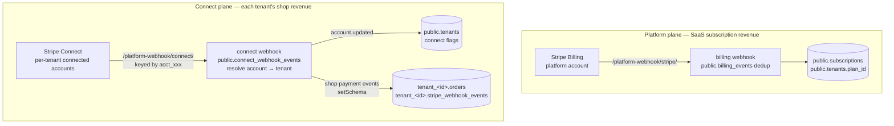

# 05 — Billing and payments

## Two Stripe planes that never cross

```mermaid
flowchart TB
    subgraph plane1["Platform plane — SaaS subscription revenue"]
        SB[Stripe Billing\nplatform account] -->|"/platform-webhook/stripe/"| WH1[billing webhook\npublic.billing_events dedup]
        WH1 --> SUBS[(public.subscriptions\npublic.tenants.plan_id)]
    end
    subgraph plane2["Connect plane — each tenant's shop revenue"]
        SC[Stripe Connect\nper-tenant connected accounts] -->|"/platform-webhook/connect/\nkeyed by acct_xxx"| WH2[connect webhook\npublic.connect_webhook_events\nresolve account → tenant]
        WH2 -->|account.updated| TEN[(public.tenants\nconnect flags)]
        WH2 -->|shop payment events\nsetSchema| ORD[("tenant_&lt;id&gt;.orders\ntenant_&lt;id&gt;.stripe_webhook_events")]
    end
```

1. **Platform plane** (`includes/PlatformStripe.php`, `includes/Subscription.php`): one Stripe
   account owned by the operator charges tenants for Pro/Studio subscriptions. State lives in
   `public.subscriptions` + `public.billing_events`.
2. **Connect plane** (`includes/ShopConnect.php`, `includes/ShopOrders.php`): each tenant
   onboards their **own** connected account (Standard or Express) so their shop's charges land on
   *their* Stripe — direct charges with `stripe_account` + `application_fee_amount` (fee currently
   0 bps, a one-value plan edit away). A tenant losing their Connect setup doesn't touch their
   subscription, and vice versa. The account id lives on `public.tenants` and never FKs across
   the schema boundary.

The inherited self-host webhook (`/shop/webhook.php`, single env-global key, host-resolved) still
exists for the self-host product; the SaaS shop uses the Connect plane.

## Webhook idempotency contract (invariant 3)

Every receiver copies the contract proven in the inherited shop webhook:

1. **INSERT the event id into the dedup ledger first** (`public.billing_events` /
   `tenant.stripe_webhook_events`; the unique key serializes concurrent retries).
   A fully-processed retry short-circuits 200.
2. Run the handler inside `Database::transaction()`.
3. Stamp `processed_at`. A crash mid-flight leaves the row with `processed_at IS NULL`, so the
   retry re-runs the handler.
4. **Mail dispatch happens after the transaction** — slow mail can't blow Stripe's 10 s delivery
   deadline.

The ledgers also carry `handler_result` (`SUCCESS` / `IGNORED` / `FAILED`) and the last error,
so a systematically failing handler shows up on the platform-admin webhook board instead of
only in the raw error log. Unhandled event types are stamped `IGNORED`, not dropped.

### Routing difference between the planes

Platform-plane events carry the tenant in the payload. Connect-plane events arrive keyed by
`event.account = acct_xxx` with **no Host context**, so they can't be host-resolved. The single
platform endpoint `/platform-webhook/connect/` runs the contract in two layers:

1. **Claim in the public ledger.** Every event is INSERTed into `public.connect_webhook_events`
   first, before any schema switch, with the resolved `tenant_id` (via the unique index on
   `tenants.stripe_connect_account_id`) or `IGNORED` for an account the platform doesn't track.
2. **Dispatch without an outer transaction.** `account.updated` is a single idempotent UPDATE of
   the Connect flags on `public.tenants`. Shop payment events (`checkout.session.completed`,
   `payment_intent.payment_failed`) go to `ShopOrders::processConnectShopEvent()`, which calls
   `setSchema`, runs the inherited INSERT-first dedup against the tenant's own
   `stripe_webhook_events`, then fulfils inside its own transaction and sends mail after it.
3. **Stamp the public row** after the handler returns; a throw records `FAILED` and returns 500
   so Stripe retries, and the tenant-side dedup stops fulfilment from running twice.

Step 2 used to sit inside an outer `Database::transaction()`. That broke on Postgres: the tenant
dedup *expects* to catch a unique violation on a retry, and a caught `23505` still aborts the
enclosing transaction, so the follow-up SELECT failed with "current transaction is aborted" and
the event 500'd on every retry forever (2026-08 audit finding L8). The rule that came out of it:
an INSERT-first claim must run autocommitted, never nested in a transaction that outlives it.

## Webhook is the source of truth — never optimistic writes

`subscriptions.local_status` and `tenants.plan_id` flip **only** on webhook events:

| Event | Effect |
|---|---|
| `customer.subscription.created` / `.updated` | Upsert the subscription row; mirror status + period end (Stripe's verbatim status mapped to a local enum: `active`/`trialing`→ACTIVE, `past_due`/`unpaid`→PAST_DUE, …); when the mapped status is ACTIVE, mirror `tenants.plan_id` to the subscribed plan |
| `invoice.paid` | Confirm ACTIVE; roll `current_period_end`; a GRACE tenant transitions back to ACTIVE |
| `customer.subscription.deleted` | Local CANCELLED; flip `tenants.plan_id` back to free |
| `invoice.payment_failed` | PAST_DUE and tenant → GRACE, but only once Stripe's retries are exhausted (`attempt_count >= 4` or no `next_payment_attempt`); earlier failures are recorded without a state change |

Anything else, `checkout.session.completed` included, is stamped `IGNORED` on the platform plane:
the subscription events carry everything the plan flip needs. Each plan change also writes a
`billing.plan_change` row via `BillingAudit::planChange()` (both plans plus monthly-equivalent
cents), which the nightly growth rollup reads for MRR movement and the audit prune never deletes.

Upgrade flow: `/admin/billing/upgrade.php` → Stripe Checkout → webhook flips the plan. Cancel
flow: `cancel_at_period_end=true` via the Stripe API, then **trust the webhook** to mirror. The
`stripe-dunning-sync` cron (hourly) reconciles subscription status for tenants in GRACE as a
belt-and-braces sweep; `payment-reminder-emails` nudges daily.

Hardening shipped from the Stripe audit: idempotency keys on `Refund::create` and
`Customer::create` (a request-timeout retry can't double-refund/double-create), and an explicitly
pinned API version so SDK/API bumps can't silently change wire shapes. The test-mode signature
bypasses used by the smokes only work under the CLI SAPI or `APP_ENV=test`; under PHP-FPM they
fail closed (2026-08 audit, I1).

One known gap against step 4 above: the platform webhook sends no mail itself, but the
GRACE → ACTIVE edge of `Tenant::transitionTo()` sends the "account restored" notice, and that
transition runs inside the webhook's transaction. The mailer call is wrapped so a failure can't
roll back the transition, but a slow send does count against Stripe's deadline.

## Purchase availability

Whether a plan can be bought is data, not config. Each `public.plans` row carries `is_active`
plus an `availability` column (`BUYABLE` / `COMING_SOON` / `TEASER`), edited in platform-admin;
the pricing page and upgrade page render from it, and `checkout.php` refuses a hand-crafted POST
for any plan that isn't active and `BUYABLE`. This replaced a global `PAID_PLANS_COMING_SOON`
env flag. Tiers themselves are a registry (`public.tiers`): a tier can exist before its first
price point, and tier saves keep the registry and the tier's plan rows in sync.
`bin/configure-plans.php` reconciles prices and Free-tier limits declaratively (`--show` /
`--apply`).

## Plan and cap enforcement

Caps are enforced **at write time in app code**, not by constraint:

- `Plan::canCreate($tenant, $what, …)` reads current counts from the tenant schema and compares
  against the plan row (`max_pieces`, `max_photos_per_piece`, `max_upload_bytes`,
  `storage_bytes` via `usage_rollups`, …). Wired into admin controllers via an
  `enforce_plan_cap()` bootstrap helper, which **fails closed**: if the cap check itself throws,
  the request gets a retryable 503 and a throttled `plan.cap_check_error` alarm in the operator
  audit log, rather than silently allowing the write (2026-08 audit, L9).
- Feature flags gate whole surfaces via `enforce_plan_flag()`, which reads only names on an
  exact allowlist (`Plan::ENTITLEMENT_FLAGS`). The shop is split into two entitlements:
  `shop_links` (Basic+: the storefront, link-out catalog products, public `/shop`) and
  `shop_checkout` (Pro+: own-site checkout through Connect, orders). Free has neither. Admin shop
  pages redirect to the upgrade page without the right flag; public `/shop.php` 404s without
  `shop_links` and `/shop/checkout.php` without `shop_checkout`, while `success`/`cancel`/`webhook`
  stay open so an in-flight order survives a downgrade. The old `allow_shop` column survives only
  as a fail-safe alias equal to `shop_checkout`; nothing reads it.
- **Downgrades never delete data**: excess pieces stay visible; the admin just can't create more
  until they delete down or re-upgrade. Custom domains stop renewing (via the `/caddy-ask`
  tenant-status check); the subdomain keeps working.
- Footer branding is a pure policy function (`Branding::footerMode()`): license byline
  (self-host), "Powered by makerfolio" (Free), none (Pro/Studio with the flag).
