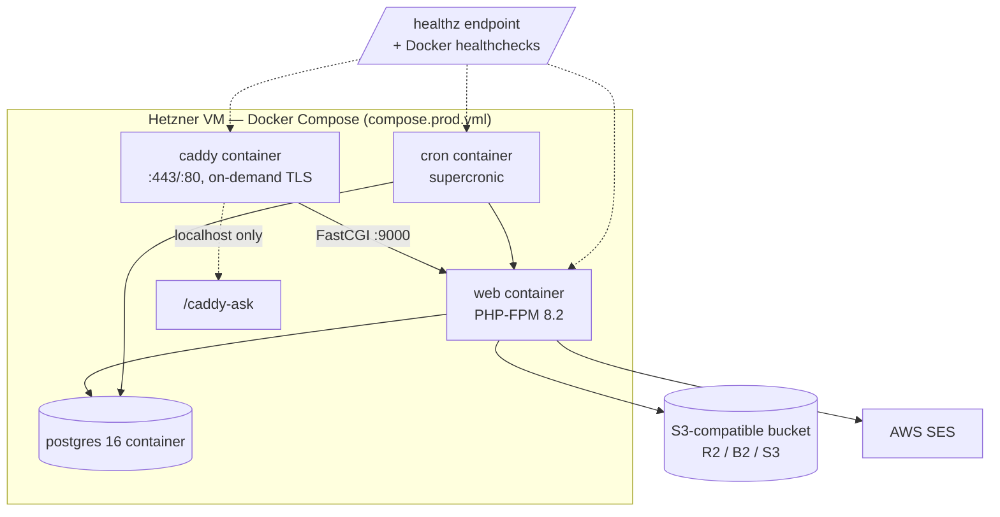

# 07 — Operations

## Deploy topology

Everything on **one Hetzner VM** (Ubuntu 24.04, Docker Compose) — complexity is the enemy at this
scale; the scaling story is "buy a bigger box" until ~10K tenants:

- The app is **stateless** beyond Postgres + object storage (PHP sessions persist across deploys
  on a mounted volume; the designed evolution at multi-VM scale is a Postgres `UNLOGGED` sessions
  table — Redis deliberately avoided).
- Deploys and rollbacks (code-only and code+DB) follow `design-docs/runbooks/DEPLOY.md`;
  first-boot server provisioning in `runbooks/HETZNER_DEPLOY.md`. Migrations auto-apply on boot.
- Cloudflare optionally fronts Caddy as a transparent CDN; admin assets are sent
  `no-store`/revalidate so deploys aren't masked by edge caches.
- The planned split at scale: Caddy edge tier (cert issuance + LB) / stateless app tier /
  managed Postgres — application code doesn't change for any of it.

## Cron fleet (supercronic)

No queue, no Redis: all async work is periodic crons under `bin/cron/`, scheduled in
`docker/crontab`, each iterating tenants with per-tenant try/finally isolation where relevant.
Every job runs through the `run.php` **heartbeat wrapper**, which records into `public.cron_runs`
— a dead-man's-switch board in platform-admin shows any job that hasn't succeeded on schedule.

| Cadence | Jobs |
|---|---|
| every 5 min | `verify-pending-domains` (DNS checks → `DNS_VERIFIED`), `monitor-provisioning-domains` (TLS probe → `ACTIVE`), `sender-identity-verify-sweep` (SES identity polling + failure guards) |
| every 15 min | `stripe-dunning-sync` (reconcile GRACE-tenant subscription status) |
| hourly | `storage-rollup` (per-tenant usage into `usage_rollups`) |
| daily | `sweep-pending-verifications` (7 d unverified → SUSPENDED), `sweep-suspended-tenants` (60 d → PENDING_DELETION → hard delete), `abandon-old-signups`, `reconcile-tenant-denorms`, `payment-reminder-emails`, `cert-health-check`, `sweep-failed-domains`, `sweep-expired-transfers`, `sweep-expired-handle-redirects`, `prune-activity-logs`, `operator-digest` (daily operator email) |

State-changing sweeps write what they did to `platform_admin_activity` (one row per transition +
a summary row only when something changed), so the operator reads outcomes in the admin UI, not
in container logs.

## Email

AWS SES (`MAIL_DRIVER=ses`, `includes/SesMailer.php`; SMTP/`mail()` drivers remain for self-host/dev).

- **Free/Pro**: shared platform identity (`noreply@makerfolio.art`) with tenant `Reply-To`.
  Transactional links are tenant-host-aware (password resets point at the tenant's own host).
- **Studio**: per-tenant white-label sender identity on their domain — DKIM CNAME wizard at
  `/admin/settings/email-sender.php`, `tenant_sender_identities` state machine, 15-min
  verification sweep, auto-DISABLED on plan downgrade. Tenant-scoped sending reputation.
- **Feedback loop**: `/ses-webhook.php` receives SNS bounce/complaint notifications
  (signature-verified), dedupes into `email_bounces`, and feeds suppression + identity-failure
  guards. All outbound mail is ledgered in `email_log`.

## Object storage

`Storage` interface with two implementations selected by `STORAGE_DRIVER`:
`LocalStorage` (dev/self-host, files under the upload path) and `S3Storage` (any S3-compatible
vendor — R2/B2/S3; the concrete bucket vendor is an `.env` decision, not a code decision).
Uploads are **PHP-proxied** (server-side validation + GD resize stay centralized; presigned
direct-to-S3 upload is a known future optimization). All media rows store tenant-prefixed
`*_storage_key`s; URL resolution goes through `StorageUrl::urlFor`. Per-tenant usage is enforced
against plan caps via the hourly rollup.

## Backups & recovery

- **Postgres**: `pg_dump` every 6 h to object storage (30-day retention) + WAL/PITR (7-day).
- **Object storage**: bucket versioning, 30-day prior-version retention.
- **Per-tenant**: schema-per-tenant makes tenant-granular export trivial —
  `Tenant::exportToZip` powers self-service export/delete/transfer at `/admin/account/`
  (the export doubles as a portable "leave for self-host" package).
- Deleted tenants remain recoverable ~30 days via PITR + object versioning.

## Observability

Post-launch ops hardening built this out well past the original "journalctl" plan:

- `/healthz` endpoint + Docker healthchecks on web, caddy, and cron containers.
- PHP errors to stderr, Caddy access logs, bounded log rotation; request-id correlation across
  app logs and the operator UI.
- Platform-admin **system-health surfaces**: cron heartbeat board (`cron_runs`), webhook ledgers
  with stuck-event drill-ins (platform + Connect planes), mail ledger, FPM/Postgres/supercronic
  metrics, rollup freshness signal, "Attention required" panel (GRACE tenants, stalled domain
  verifications, pending deletions), daily operator digest email.
- `pg_stat_statements` enabled for query-level diagnosis.
- Runbooks: `INCIDENTS.md` (7 incident classes with diagnose/recover/prevent),
  `MONITORING.md` (per-subsystem signal tables + alert severities).

## Performance envelope

Server-rendered pages budget 8–25 queries, p95 under 200–400 ms; tenancy adds exactly one cached
lookup per request. ~10K tenants ≈ 12 req/s aggregate — comfortably a one-box workload; Postgres
is the eventual limit (~50K tenants), with PgBouncer transaction pooling compatible with the
`search_path` scheme.

## Testing strategy

- **PHPUnit** (420+ tests): pure helpers and extractable logic only; the test bootstrap loads no
  `.env`/DB/Stripe (in-memory SQLite), so the suite runs anywhere. GD-dependent tests skip
  cleanly.
- **Smokes** (45+ `bin/*-smoke.php`): DB-touching flows — provisioning, tenant isolation,
  billing + webhooks, domain routing, `/caddy-ask` policy, storage backends, cron policies —
  each asserting against a real Postgres. `pg-smoke` runs in a throwaway schema.
- **CI gate**: `php -l` on every file + the full PHPUnit suite must be green.
- Cron policy correctness is deliberately smoke-tested rather than unit-tested (the decisions are
  SQL `WHERE` clauses, not extractable pure functions).
