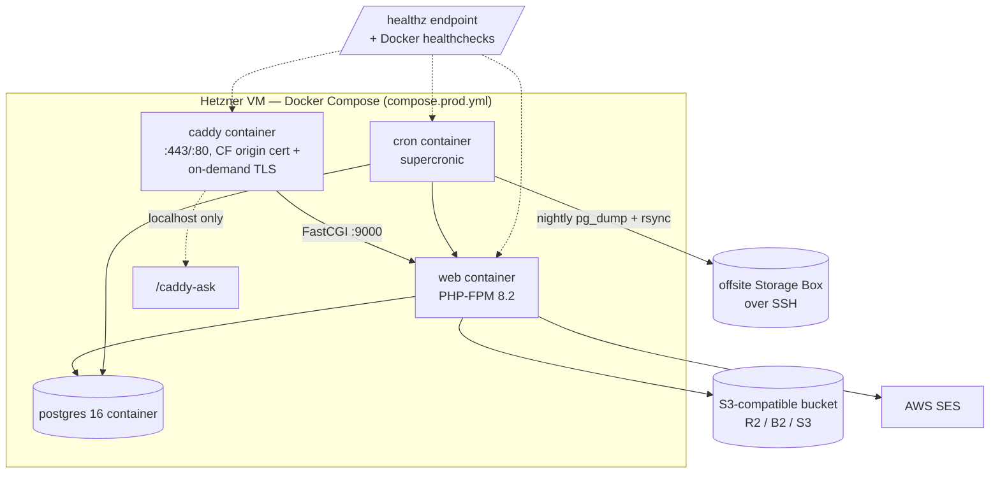

# 07 — Operations

## Deploy topology

Everything on **one Hetzner VM** (Ubuntu 24.04, Docker Compose) — complexity is the enemy at this
scale; the scaling story is "buy a bigger box" until ~10K tenants:

```mermaid
flowchart TB
    subgraph vm["Hetzner VM — Docker Compose (compose.prod.yml)"]
        CADDY[caddy container\n:443/:80, CF origin cert +\non-demand TLS] -->|FastCGI :9000| FPM[web container\nPHP-FPM 8.2]
        CADDY -.->|localhost only| ASK["/caddy-ask"]
        FPM --> PG[(postgres 16 container)]
        CRON[cron container\nsupercronic] --> PG
        CRON --> FPM
    end
    FPM --> S3[(S3-compatible bucket\nR2 / B2 / S3)]
    FPM --> SES[AWS SES]
    CRON -->|nightly pg_dump + rsync| BOX[(offsite Storage Box\nover SSH)]
    HC[/healthz endpoint\n+ Docker healthchecks/] -.-> CADDY & FPM & CRON
```

- The app is **stateless** beyond Postgres + object storage (PHP sessions persist across deploys
  on a mounted volume; the designed evolution at multi-VM scale is a Postgres `UNLOGGED` sessions
  table — Redis deliberately avoided).
- Deploys and rollbacks (code-only and code+DB) follow `design-docs/runbooks/DEPLOY.md`;
  first-boot server provisioning in `runbooks/HETZNER_DEPLOY.md`. Migrations auto-apply on boot.
- Cloudflare proxies the platform apex and tenant subdomains (Caddy serves a Cloudflare origin
  certificate for those); customer custom domains bypass Cloudflare and hit Caddy directly. Admin
  assets are sent `no-store`/revalidate so deploys aren't masked by edge caches.
- The planned split at scale: Caddy edge tier (cert issuance + LB) / stateless app tier /
  managed Postgres — application code doesn't change for any of it.

## Cron fleet (supercronic)

No queue, no Redis: all async work is periodic crons under `bin/cron/`, scheduled in
`docker/crontab`, each iterating tenants with per-tenant try/finally isolation where relevant.
Every job runs through the `run.php` **heartbeat wrapper**, which records into `public.cron_runs`
— a dead-man's-switch board in platform-admin shows any job that hasn't succeeded on schedule.

18 jobs on 6 schedule lines. Jobs that share a cadence share a crontab line (`run.php` takes
several job names), but each still runs in its own child process and writes its own heartbeat
row, so one failing job doesn't hide behind a neighbour. `CronHeartbeatTest` parses the crontab
and fails if it drifts from `CronHeartbeat::EXPECTED_INTERVAL_MINUTES`, which keeps the
dead-man's-switch thresholds honest.

| Cadence | Jobs |
|---|---|
| every 5 min | `verify-pending-domains` (DNS checks → `DNS_VERIFIED`), `monitor-provisioning-domains` (TLS probe → `ACTIVE`) |
| every 15 min | `sender-identity-verify-sweep` (SES identity polling + failure guards), `uirlis-telemetry` (optional external health push) |
| hourly | `storage-rollup` (per-tenant usage into `usage_rollups`), `stripe-dunning-sync` (reconcile GRACE-tenant subscription status; a webhook backstop, so hourly is enough) |
| daily, in order | `sweep-pending-verifications`, `sweep-suspended-tenants` (60 d → PENDING_DELETION → hard delete), `abandon-old-signups`, `reconcile-tenant-denorms`, `sweep-failed-domains`, `cert-health-check`, `payment-reminder-emails`, `check-uploads-tree` (storage-layout invariant, below), `prune-activity-logs` (also drops expired `handle_redirects` rows), `operator-digest` (daily operator email) |
| 00:45 daily | `metrics-rollup` (growth metrics, below) |
| 03:15 daily | `backup-offsite` |

Two sweeps were retired in the 2026-08 simplification pass (`sweep-expired-transfers`,
`sweep-expired-handle-redirects`): the pages that read those rows already filter on
`expires_at`, so the sweeps were cosmetic.

State-changing sweeps write what they did to `platform_admin_activity` (one row per transition +
a summary row only when something changed), so the operator reads outcomes in the admin UI, not
in container logs.

## Email

AWS SES (`MAIL_DRIVER=ses`, `includes/SesMailer.php`; SMTP/`mail()` drivers remain for self-host/dev).

- **Free/Pro**: shared platform identity (`noreply@makerfolio.art`) with tenant `Reply-To`.
  Transactional links are tenant-host-aware (password resets point at the tenant's own host).
- **Studio**: per-tenant white-label sender identity on their domain — DKIM CNAME wizard at
  `/admin/settings/email-sender.php`, `tenant_sender_identities` state machine, 15-min
  verification sweep, auto-DISABLED on plan downgrade. Tenant-scoped sending reputation.
- **Feedback loop**: `/ses-webhook.php` receives SNS bounce/complaint notifications
  (signature-verified), dedupes into `email_bounces`, and feeds suppression + identity-failure
  guards. All outbound mail is ledgered in `email_log`.

## Object storage

`Storage` interface with two implementations selected by `STORAGE_DRIVER`:
`LocalStorage` (dev/self-host, files under the upload path) and `S3Storage` (any S3-compatible
vendor — R2/B2/S3; the concrete bucket vendor is an `.env` decision, not a code decision).
Uploads are **PHP-proxied** (server-side validation + GD resize stay centralized; presigned
direct-to-S3 upload is a known future optimization). All media rows store tenant-prefixed
`*_storage_key`s; URL resolution goes through `StorageUrl::urlFor`. Per-tenant usage is enforced
against plan caps via the hourly rollup.

Tenant scoping of keys is structural, the storage-layer equivalent of `search_path`:

- `get_storage()` returns a **`TenantStorage`** decorator whenever a tenant is resolved. It is the
  only place a `<tenant_id>/` key root is assembled: relative keys get the root prepended, a
  fully-qualified key passes only if its root matches the bound tenant, and a key rooted in
  another tenant's prefix throws. A flat (un-rooted) key is unrepresentable in tenant context.
- Platform-scope code (the usage rollup, `Tenant::hardDelete`'s prefix purge, repair scripts)
  asks for the raw driver explicitly via `get_storage_backend()` / `StorageFactory::backend()`.
- In tenant context uploads write to storage only. The old flat-disk copy under
  `public/uploads/<subdir>/` outlived the legacy-column drop for a while and wrote unread,
  unmetered duplicates, which is why the wrapper now makes that path impossible rather than
  discouraged.
- The nightly `check-uploads-tree` cron asserts every file under `uploads/` sits inside a numeric
  `<tenant_id>/` root and exits non-zero the day a regression appears;
  `bin/migrate-flat-uploads.php` (idempotent) repairs a tree that already has flat files.
- Image intake rejects pixel-flood images (checked with `getimagesize` before GD decodes) and derives the stored extension from the validated MIME type, never from the
  uploaded filename.

## Backups & recovery

- **Nightly offsite** (`backup-offsite`, 03:15 UTC): a `pg_dump -Fc` of the whole database
  (public plus every tenant schema in one file, selectively restorable with `pg_restore`) and an
  rsync of the uploads volume, both over SSH to an offsite storage box. Dumps are pruned after a
  configurable retention window. The rsync deliberately runs **without `--delete`**,
  so a mass-deletion bug or compromise can't propagate into the backup on the next tick.
- The job is a no-op until its destination is configured, and a configured-but-broken run exits
  non-zero, so the heartbeat board shows it FAILING rather than silently not backing up.
- **Per-tenant**: schema-per-tenant makes tenant-granular export trivial —
  `Tenant::exportToZip` powers self-service export/delete/transfer at `/admin/account/`
  (the export doubles as a portable "leave for self-host" package).
- What isn't built: the original design called for 6-hourly dumps plus WAL/PITR and bucket
  versioning. None of that exists; recovery granularity is the last nightly dump. A deleted
  tenant is recoverable from a dump inside the retention window, not from PITR.

## Observability

Post-launch ops hardening built this out well past the original "journalctl" plan:

- `/healthz` endpoint + Docker healthchecks on web, caddy, and cron containers.
- PHP errors to stderr, Caddy access logs, bounded log rotation; request-id correlation across
  app logs and the operator UI.
- Platform-admin **system-health surfaces**: cron heartbeat board (`cron_runs`), webhook ledgers
  with stuck-event drill-ins (platform + Connect planes), mail ledger, FPM/Postgres/supercronic
  metrics, rollup freshness signal, "Attention required" panel (GRACE tenants, stalled domain
  verifications, pending deletions), daily operator digest email.
- `pg_stat_statements` enabled for query-level diagnosis.
- An optional health push (`uirlis-telemetry`, every 15 min) to an external monitor; a no-op
  unless configured.
- **Growth metrics**: the nightly `metrics-rollup` UPSERTs one row per day into
  `public.platform_metrics_daily` (signups, activations, churn flows, MRR, tier mix as JSONB,
  never-activated and dormant-at-14/30/60-day counts). `MetricsRollup` keeps the arithmetic in
  pure, unit-tested helpers and the SQL in two small DB methods. Platform-admin renders it at
  `/platform-admin/growth/` with a CSV export.
- **Referral attribution**: first-touch `?ref=` capture into the session at resolve time, copied
  onto the signup and stamped once onto `tenants.referral_*` at verification (never
  overwritten). The referring tenant is stored as a plain slug string, not an FK, in keeping with
  invariant 2. `/platform-admin/referrals/` reports signups per live free site per month.
- Runbooks: `INCIDENTS.md` (7 incident classes with diagnose/recover/prevent),
  `MONITORING.md` (per-subsystem signal tables + alert severities).

## Performance envelope

Server-rendered pages budget 8–25 queries, p95 under 200–400 ms; tenancy adds exactly one cached
lookup per request. ~10K tenants ≈ 12 req/s aggregate — comfortably a one-box workload; Postgres
is the eventual limit (~50K tenants), with PgBouncer transaction pooling compatible with the
`search_path` scheme.

## Testing strategy

- **PHPUnit** (~650 tests across 62 files): pure helpers and extractable logic only; the test bootstrap loads no
  `.env`/DB/Stripe (in-memory SQLite), so the suite runs anywhere. GD-dependent tests skip
  cleanly.
- **Smokes** (47 scripts under `bin/` and `bin/cron/`): DB-touching flows — provisioning, tenant isolation,
  billing + webhooks, domain routing, `/caddy-ask` policy, storage backends, cron policies —
  each asserting against a real Postgres. `pg-smoke` runs in a throwaway schema.
- **CI gate**: `php -l` on every file + the full PHPUnit suite must be green.
- Cron policy correctness is deliberately smoke-tested rather than unit-tested (the decisions are
  SQL `WHERE` clauses, not extractable pure functions).
